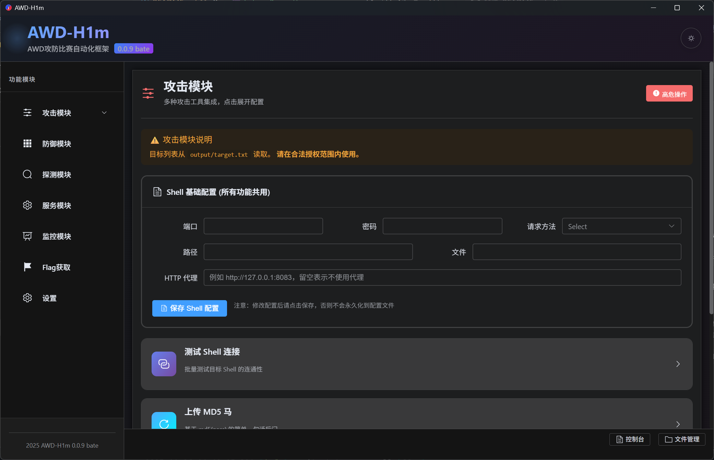
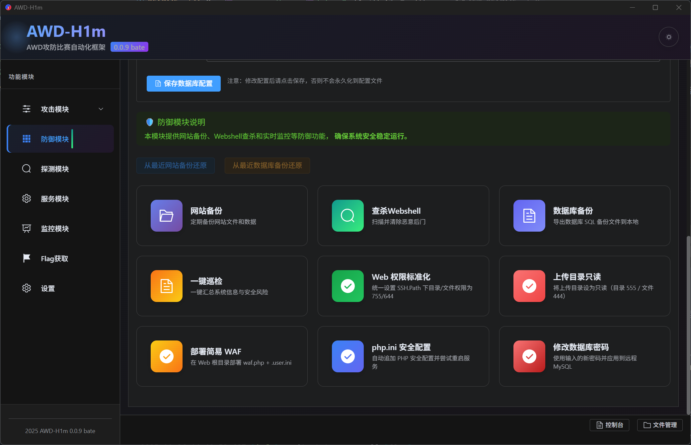
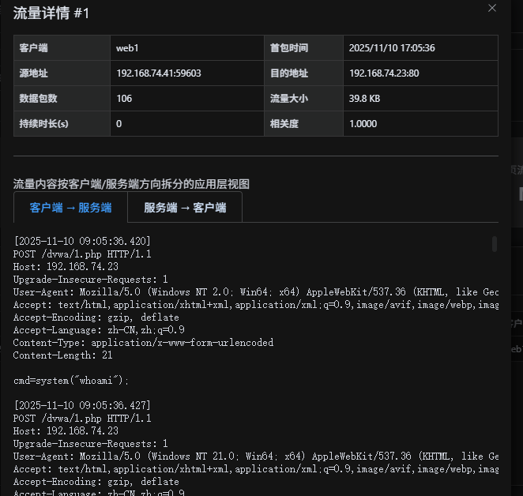
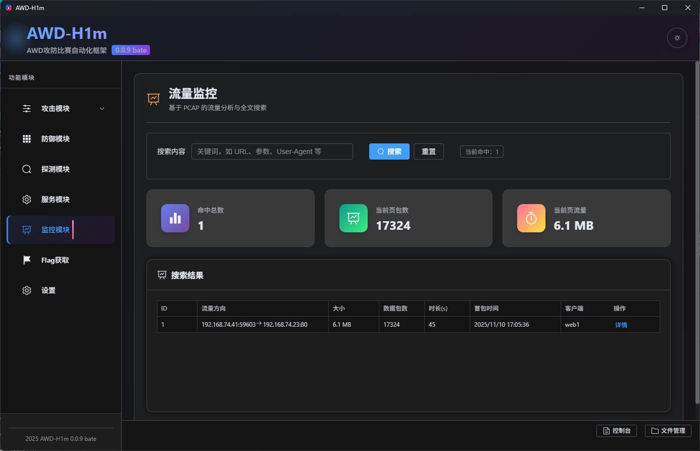

# AWD-H1m

> **AWD 攻防竞赛自动化工具箱**

AWD-H1m 是一款专为 CTF AWD (Attack With Defense) 赛制设计的桌面应用程序，帮助参赛选手在有限的比赛时间内高效完成攻击、防御、流量分析与 Flag 提交等核心任务。

---

## 项目简介

在 AWD 竞赛中，选手需要同时扮演攻击者与防御者角色：既要快速发现并利用对手靶机的漏洞获取 Flag，又要加固自身服务、抵御来自其他队伍的攻击。AWD-H1m 将这些繁琐的手工操作整合为一套可视化的自动化工具，让选手专注于策略制定而非重复劳动。

---

## 核心功能

### ⚔️ 攻击模块
- **Shell 连接测试**：批量验证目标靶机的 Webshell 连通性
- **一键上马**：支持 MD5 马、不死马、蠕虫马等多种类型的自动化部署
- **远程命令执行**：通过已植入的 Shell 对目标批量执行系统命令

</td>
</tr>
</table>

### 🛡️ 防御模块
- **网站备份与还原**：一键备份 Web 根目录，支持快速回滚
- **木马查杀**：扫描并定位可疑的一句话木马文件
- **主机巡检**：自动检测系统安全配置，输出加固建议
- **权限加固**：设置上传目录只读、加固 PHP 配置、部署简易 WAF
- **数据库管理**：备份数据库、修改数据库密码
</td>
</tr>
</table>

### 🔍 探测模块
- **主机存活探测**：快速扫描目标 IP 段，发现存活主机

### 📡 流量监控
- **流量捕获与存储**：自动记录比赛期间的网络流量
- **全文检索**：基于索引的流量内容搜索，快速定位攻击 Payload
- **流量详情**：查看单条会话的请求与响应内容
</td>
</tr>
</table>

</td>
</tr>
</table>

### 🚩 Flag 获取
- **批量 Flag 读取**：从多个靶机自动读取 Flag 文件
- **多种 Shell 支持**：可选择基础 Shell、不死马或蠕虫马方式获取

### 🔧 服务管理
- **SSH 批量改密**：一键修改多台主机的 SSH 登录密码

---

## 使用说明

1. 启动应用后，首先在配置中填写目标靶机的连接信息（Shell 路径、SSH 凭据等）
2. 根据比赛阶段选择对应模块：
   - **开局**：使用探测模块扫描存活主机，使用防御模块备份并加固自身服务
   - **攻击阶段**：使用攻击模块批量上马、执行命令
   - **持续阶段**：使用 Flag 获取模块自动化采集 Flag，使用监控模块分析可疑流量
3. 所有操作日志可在控制台面板中实时查看

---

## 后续计划
自动部署流量探针

PHP 专属模块，php

Java 专属模块，Java 反编译，打包

添加自定义 Payload

调整防护模块，添加一键布防

## 许可证

本项目为闭源软件，未经授权不得分发或用于其他用途。
